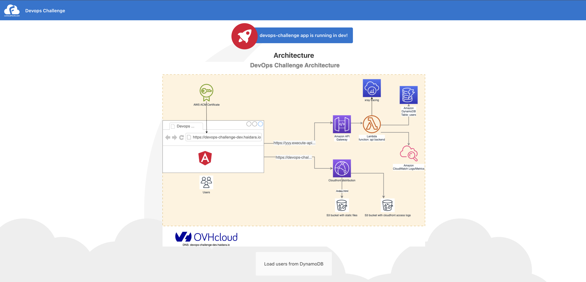

# DevOps challenge

A Project to demonstrate how to deploy a basic modern web app on AWS with Terraform.

May be used as a starting point for a more complete application. This stack should fall under AWS free tier (the first
12 months). Some components were not included because they don't have a free tier.

## Background and requirements

You have been asked to create a website for a modern company that has recently migrated their entire infrastructure to
AWS. They want you to demonstrate a basic website with some text and an image, hosted and managed using modern standards
and practices in AWS.

You can create your own application, or use open source or community software. The proof of concept is to demonstrate
**hosting, managing, and scaling an enterprise-ready system**. This is not about website content or UI.

Requirements:

- Deliver the tooling to set up an application which displays a web page with text and an image in AWS. (AWS free-tier
  is fine)
- Provide and document a mechanism for scaling the service and delivering the content to a larger audience.
- Source code should be provided via a publicly accessible GitHub repository.
- Provide basic documentation to run the application along with any other documentation you think is appropriate.

## Implementation

From the background, I will deploy a simple Single Page Application (SPA) with a backend fetching some data from a
database.

As the goal is to demonstrate a basic website on AWS, I have kept things simple by using a **serverless architecture**
with the AWS following services:

- A S3 bucket to host the static files. [Angular](https://angular.io/) is used to generate the frontend that will
  display an image describing the architecture used and some data from a Dynamodb Table. The files in the bucket are NOT
  public. The bucket is used as an origin for a cloudfront distribution.
- A Cloudfront distribution will serve the web application in front of the S3 bucket. Using cloudfront will **speed up
  the website loading**: the static content (HTML, CSS and JS) will be available from AWS Data centers around the
  world. **No action required to scale the frontend**.   
  The distribution price class is set `PriceClass_100` (North America, Europe and Israel). It defines on which edge
  location Cloudfront will serve the requests. In order to target another
  audience, [change the price class.](https://docs.aws.amazon.com/AmazonCloudFront/latest/DeveloperGuide/PriceClass.html)
- An S3 bucket for Cloudfront standard access logs. It can be connected
  to [AWS Athena](https://aws.amazon.com/blogs/big-data/easily-query-aws-service-logs-using-amazon-athena/) for further
  analysis.
- A Lambda function will be used as a backend behind an HTTP API powered by AWS API Gateway. This API will expose a
  single endpoint to get the users (`/users`) in the Dynamodb table described below.   
  If your backend and traffic is expected to grow significantly in size and complexity, you may consider using a Docker
  container on ECS. There is also a quota on
  [Lambda function concurrent executions](https://docs.aws.amazon.com/lambda/latest/dg/gettingstarted-limits.html) that
  we need to be aware of and monitor when serving the website to a larger audience.
- Xray for tracing on the Lambda function. Lambda logs are pushed to a Cloudwatch log group.
- A Dynamodb table will store the data. The data consists of some fake data about users (
  see [users.json](backend/users.json)).
  Terraform reads that file and put the items in Dynamodb.
  A provisioned billing mode is used for this project. Depending on your usage, you may
  consider [On Demand mode](https://aws.amazon.com/blogs/aws/amazon-dynamodb-on-demand-no-capacity-planning-and-pay-per-request-pricing/)
  or increase the provisioned capacities.

This project also demonstrates the following features of Terraform:

- Cross-region deployment with the CloudFront ACM certificate in us-east-1 (mandatory)
- Multi cloud by using OVH DNS zone instead of AWS Route53
- Terraform local provisioners to deploy the frontend to an S3 bucket only when there are changes


### Custom domain with OVH

If you have an existing DNS Zone on [OVH](https://www.ovhcloud.com/fr/), you can leverage it to have a custom domain on
 top of your CloudFront distribution. To use it, set the variable `ovh_domain_conf`.

Example:

```shell
# Will use the domain haidara.io on OVH to create a DNS record with the following format: ${var.prefix}-${var.env}.haidara.io
export TF_VAR_ovh_domain_conf='{"dns_zone_name": "haidara.io"}'
# Or this one will create demo.haidara.io`
export TF_VAR_ovh_domain_conf='{"dns_zone_name": "haidara.io", "subdomain": "demo"}'
```

### Screenshot



The authentication is not covered by this project. For those who want to go further about authentication, go check
out [AWS Cognito](https://aws.amazon.com/fr/cognito/) and/or [AWS Amplify](https://aws.amazon.com/fr/cognito/).

### Terraform

Terraform is used to deploy the architecture above and copy the static files to S3. The static files are copied only
when:

- The S3 bucket has changed
- The `index.html` has changed (a new build has been made with some changes in the files)
- The `config.json` has changed. `config.json` is the file containing some configuration such as the API URL and the
  environment name. The template build of this file is located
  at [frontend/src/assets/config.tpl.json.](frontend/src/assets/config.tpl.json)


### Repository: monorepo structure

This mono repository has the following structure:

```shell
.
├── backend # The backend in Lambda
│   ├── README.md
│   ├── main.py
│   └── users.json # Some fake users list
├── frontend # Angular frontend application
│   ├── src
│   ├── README.md
│   ├── angular.json
│   ├── karma.conf.js
│   ├── package-lock.json
│   ├── package.json
│   ├── tsconfig.app.json
│   ├── tsconfig.json
│   └── tsconfig.spec.json
├── img
│   ├── architecture.drawio
│   ├── architecture.png
│   └── screenshot.png
├── README.md
├── api-lambda.tf # API Gateway, Lambda function 
├── data.tf # Data sources
├── frontend.tf # Frontend resources: S3 buckets, cloudfront
├── terraform.tf # Terraform Providers 
├── monitoring.tf # SNS, alarms
├── outputs.tf # Terraform outputs
├── ovh-acm.tf # OVH and ACM configuration
└── variables.tf # Variables for terraform
```

### Deployment

To deploy the application, you need:

- An AWS account and an IAM user with the required permissions. The user's credentials need to be configured in your
  terminal.
- [Optional] Angular CLI and Node to build the frontend. You can find the build in
  the [releases page](https://github.com/haidaraM/devops-challenge/releases).
- AWS CLI to sync the static files to S3
- Terraform CLI

In case you want to build the frontend:

```shell
npm install -g @angular/cli
cd frontend
npm install
npm run build # Will generate the artifacts in dist/devops-challenge
```

Otherwise, download the zip `front-devops-challenge-v1.0.0.zip` from the releases page and extract it in the `frontend`
folder. You should have this structure `front/dist/devops-challenge`.

To deploy the application, from the root folder of the repository:

```shell
# Should export the required AWS variables before
terraform init
terraform apply # Then enter yes
```

The output should look like this:

```shell
users_endpoint = "https://f08q1l967c.execute-api.eu-west-2.amazonaws.com/users"
website_url = "https://d1n3neitxvtko9.cloudfront.net"
```

### Security

As mentioned above, no authentication mechanism is provided by this project. If the web application is meant to serve
some restricted content/features, AWS Cognito may help.  
The [allowed origins to access the API](https://docs.aws.amazon.com/apigateway/latest/developerguide/http-api-cors.html)
is also set to `*` for simplicity. One way to avoid cross origins requests is to put the API Gateway as another origin
behind the same cloudfront distribution at `/api`.

To go further, one can enable AWS Web Application Firewall (WAF) on the cloudfront distribution and the API Gateway (if
using a REST API). It will protect against some common web exploits and bots.

For restricting data access, a key KMS with a restricted policy can be applied to the Dynamodb Table. Only the necessary
services, persons should have access to this key.

### Monitoring/Alerting

Some components and metrics to monitor:

- Alarm on Lambda function error metric (implemented)
- Alarms on CloudFront metrics: 4xxErrorRate, 5xxErrorRate
- Alarms Dynamodb throttle metrics (implemented), ConsumedReadCapacityUnits and ConsumedWriteCapacityUnits
- API Gateway metrics

These alarms can be configured in Cloudwatch with an SNS topic destination (implemented). The alarm names start with the
environment name to quickly identify which environnement is affected by the alarm.

As X-ray is enabled on the Lambda function, you may understand how your Lambda is behaving regarding its access to other
services.

### Automation

As everything is done with Terraform, we could implement the following jobs in any CI/CD tool:

- Jobs for linting/validation:
    - Lint on backend: pylint,...
    - Lint on frontend: tslint,...
    - Lint on Terraform: tflint, terraform validate
- Build the frontend and export the build as artifacts:
- Tests:
    - Unit tests on the backend
    - E2E tests on the frontend by mocking the backend
- Terraform init/plan (needs the build artifacts)
- Terraform apply (needs the build artifacts). It may be a manual job

Before launching Terraform in a pipeline, we should first set up a S3 backend (for example) to store the state file.

## Terraform configuration

<!-- BEGIN_TF_DOCS -->
### Requirements

| Name | Version |
|------|---------|
| <a name="requirement_terraform"></a> [terraform](#requirement\_terraform) | >= 1.7 |
| <a name="requirement_aws"></a> [aws](#requirement\_aws) | ~> 5 |
| <a name="requirement_external"></a> [external](#requirement\_external) | ~> 2 |
| <a name="requirement_null"></a> [null](#requirement\_null) | ~> 3 |
| <a name="requirement_ovh"></a> [ovh](#requirement\_ovh) | ~> 0.37 |

### Providers

| Name | Version |
|------|---------|
| <a name="provider_aws"></a> [aws](#provider\_aws) | ~> 5 |
| <a name="provider_aws.cloudfront-us-east-1"></a> [aws.cloudfront-us-east-1](#provider\_aws.cloudfront-us-east-1) | ~> 5 |
| <a name="provider_ovh"></a> [ovh](#provider\_ovh) | ~> 0.37 |
| <a name="provider_terraform"></a> [terraform](#provider\_terraform) | n/a |

### Modules

| Name | Source | Version |
|------|--------|---------|
| <a name="module_lambda_function"></a> [lambda\_function](#module\_lambda\_function) | terraform-aws-modules/lambda/aws | 7.2.1 |

### Resources

| Name | Type |
|------|------|
| [aws_acm_certificate.cf_certificate](https://registry.terraform.io/providers/hashicorp/aws/latest/docs/resources/acm_certificate) | resource |
| [aws_acm_certificate_validation.validation](https://registry.terraform.io/providers/hashicorp/aws/latest/docs/resources/acm_certificate_validation) | resource |
| [aws_apigatewayv2_api.http_api](https://registry.terraform.io/providers/hashicorp/aws/latest/docs/resources/apigatewayv2_api) | resource |
| [aws_apigatewayv2_integration.lambda_integration](https://registry.terraform.io/providers/hashicorp/aws/latest/docs/resources/apigatewayv2_integration) | resource |
| [aws_apigatewayv2_route.users](https://registry.terraform.io/providers/hashicorp/aws/latest/docs/resources/apigatewayv2_route) | resource |
| [aws_apigatewayv2_stage.default_stage](https://registry.terraform.io/providers/hashicorp/aws/latest/docs/resources/apigatewayv2_stage) | resource |
| [aws_cloudfront_distribution.website](https://registry.terraform.io/providers/hashicorp/aws/latest/docs/resources/cloudfront_distribution) | resource |
| [aws_cloudfront_origin_access_identity.origin_access_identity](https://registry.terraform.io/providers/hashicorp/aws/latest/docs/resources/cloudfront_origin_access_identity) | resource |
| [aws_cloudwatch_metric_alarm.dynamodb_throttled_requests](https://registry.terraform.io/providers/hashicorp/aws/latest/docs/resources/cloudwatch_metric_alarm) | resource |
| [aws_cloudwatch_metric_alarm.lambda_errors](https://registry.terraform.io/providers/hashicorp/aws/latest/docs/resources/cloudwatch_metric_alarm) | resource |
| [aws_dynamodb_table.users](https://registry.terraform.io/providers/hashicorp/aws/latest/docs/resources/dynamodb_table) | resource |
| [aws_dynamodb_table_item.users](https://registry.terraform.io/providers/hashicorp/aws/latest/docs/resources/dynamodb_table_item) | resource |
| [aws_iam_role_policy.lambda_dynamodb_access](https://registry.terraform.io/providers/hashicorp/aws/latest/docs/resources/iam_role_policy) | resource |
| [aws_s3_bucket.cf_access_logs](https://registry.terraform.io/providers/hashicorp/aws/latest/docs/resources/s3_bucket) | resource |
| [aws_s3_bucket.origin_website](https://registry.terraform.io/providers/hashicorp/aws/latest/docs/resources/s3_bucket) | resource |
| [aws_s3_bucket_acl.cf_logs_acl](https://registry.terraform.io/providers/hashicorp/aws/latest/docs/resources/s3_bucket_acl) | resource |
| [aws_s3_bucket_ownership_controls.cf_access_logs](https://registry.terraform.io/providers/hashicorp/aws/latest/docs/resources/s3_bucket_ownership_controls) | resource |
| [aws_s3_bucket_policy.cf_origin_bucket_policy](https://registry.terraform.io/providers/hashicorp/aws/latest/docs/resources/s3_bucket_policy) | resource |
| [aws_s3_object.architecture_img](https://registry.terraform.io/providers/hashicorp/aws/latest/docs/resources/s3_object) | resource |
| [aws_sns_topic.alerting](https://registry.terraform.io/providers/hashicorp/aws/latest/docs/resources/sns_topic) | resource |
| [ovh_domain_zone_record.cert_validation_record](https://registry.terraform.io/providers/ovh/ovh/latest/docs/resources/domain_zone_record) | resource |
| [ovh_domain_zone_record.cf_record](https://registry.terraform.io/providers/ovh/ovh/latest/docs/resources/domain_zone_record) | resource |
| [terraform_data.deploy_to_s3](https://registry.terraform.io/providers/hashicorp/terraform/latest/docs/resources/data) | resource |
| [terraform_data.invalidate_cache](https://registry.terraform.io/providers/hashicorp/terraform/latest/docs/resources/data) | resource |
| [aws_caller_identity.current](https://registry.terraform.io/providers/hashicorp/aws/latest/docs/data-sources/caller_identity) | data source |
| [aws_canonical_user_id.current](https://registry.terraform.io/providers/hashicorp/aws/latest/docs/data-sources/canonical_user_id) | data source |
| [aws_cloudfront_cache_policy.cache_optimized](https://registry.terraform.io/providers/hashicorp/aws/latest/docs/data-sources/cloudfront_cache_policy) | data source |
| [aws_cloudfront_log_delivery_canonical_user_id.awslogsdelivery](https://registry.terraform.io/providers/hashicorp/aws/latest/docs/data-sources/cloudfront_log_delivery_canonical_user_id) | data source |
| [aws_iam_policy_document.lambda_dynamodb_access](https://registry.terraform.io/providers/hashicorp/aws/latest/docs/data-sources/iam_policy_document) | data source |
| [aws_iam_policy_document.origin_bucket_policy](https://registry.terraform.io/providers/hashicorp/aws/latest/docs/data-sources/iam_policy_document) | data source |

### Inputs

| Name | Description | Type | Default | Required |
|------|-------------|------|---------|:--------:|
| <a name="input_aws_region"></a> [aws\_region](#input\_aws\_region) | Region to deploy to | `string` | `"eu-west-3"` | no |
| <a name="input_default_tags"></a> [default\_tags](#input\_default\_tags) | Default tags to apply to resources | `map(string)` | <pre>{<br>  "app": "devops-challenge"<br>}</pre> | no |
| <a name="input_env"></a> [env](#input\_env) | Name of the environment | `string` | `"dev"` | no |
| <a name="input_invalid_cache"></a> [invalid\_cache](#input\_invalid\_cache) | Flag indicating if we should invalidate the Cloudfront Cache after each deployment of the files to the S3 bucket. | `bool` | `false` | no |
| <a name="input_ovh_domain_conf"></a> [ovh\_domain\_conf](#input\_ovh\_domain\_conf) | OVH DNS zone configuration if you want to use a custom domain. | <pre>object({<br>    dns_zone_name = string<br>    subdomain     = optional(string, "")<br><br>  })</pre> | <pre>{<br>  "dns_zone_name": "",<br>  "subdomain": ""<br>}</pre> | no |
| <a name="input_prefix"></a> [prefix](#input\_prefix) | A prefix appended to each resource | `string` | `"devops-challenge"` | no |

### Outputs

| Name | Description |
|------|-------------|
| <a name="output_users_endpoint"></a> [users\_endpoint](#output\_users\_endpoint) | API Gateway url to access users |
| <a name="output_website_url"></a> [website\_url](#output\_website\_url) | Cloudfront URL to access the website |
<!-- END_TF_DOCS -->
